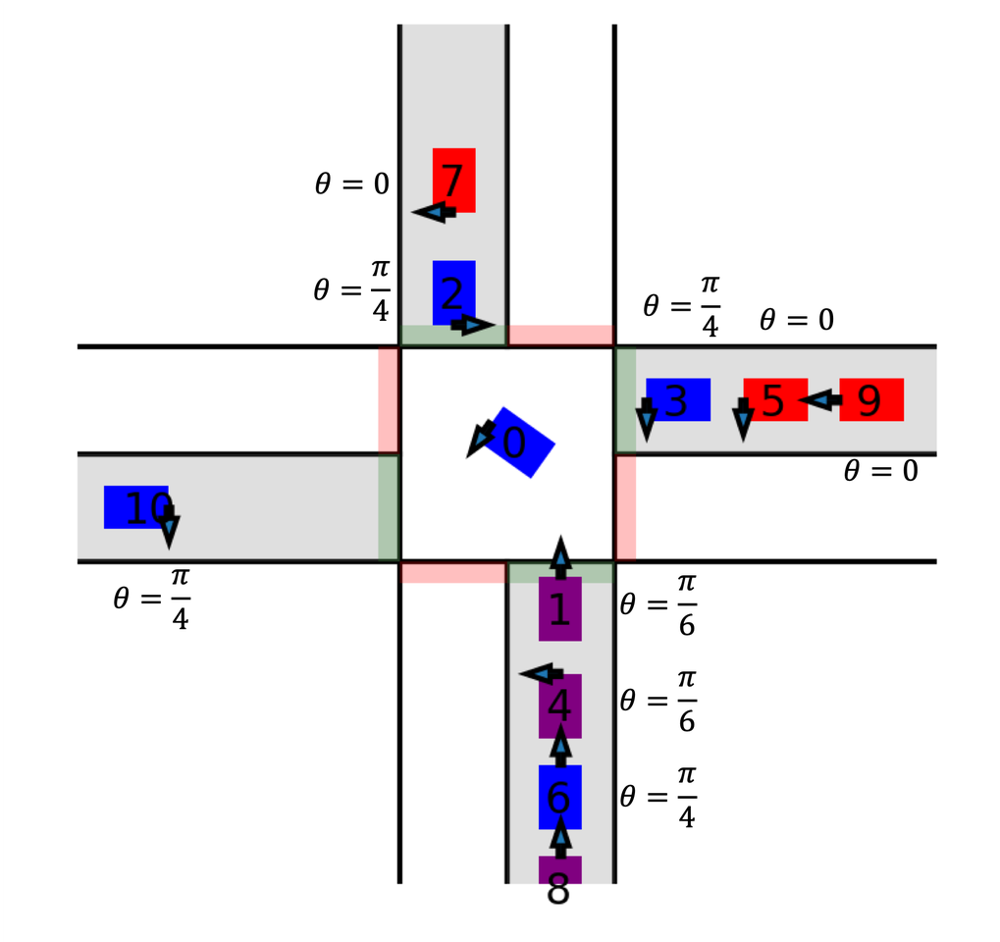

# svo-intersection
Simulation and code for a socially-compliant intersection manager
that coordinates human and autonomous vehicles on the road.

Author:  Noam Buckman

Email:  nbuckman@mit.edu

Affiliation:  MIT CSAIL

## Screenshot:

## Video: TODO

# Repo Structure
scripts:  
- make_experiments.py:  Helpeful scripts to generate experiment settings before running the actual simulations
- run_experiments.py:  Run simulations for each experiment and save results

src:       //Main objects used in the code
- TrafficSimulator.py
- TrafficCoordinator.py
- AutonomousVehicle.py
- kinematics.py
- history.py ## TODO

results:  //results are saved here

Dependencies:
- matplotlib
- numpy
- shapely
- queue

# Cite
If you use the code for research, please cite the paper:

"Buckman, N., Pierson, A., Schwarting, W., Karaman, S., & Rus, D. (2019). Sharing is Caring: Socially-Compliant Autonomous Intersection Negotiation. In 2019 IEEE/RSJ International Conference on Intelligent Robots and Systems (IROS) (pp. 6136–6143). IEEE. https://doi.org/10.1109/IROS40897.2019.8967997"

Open Source Paper Link:  https://hdl.handle.net/1721.1/124021
